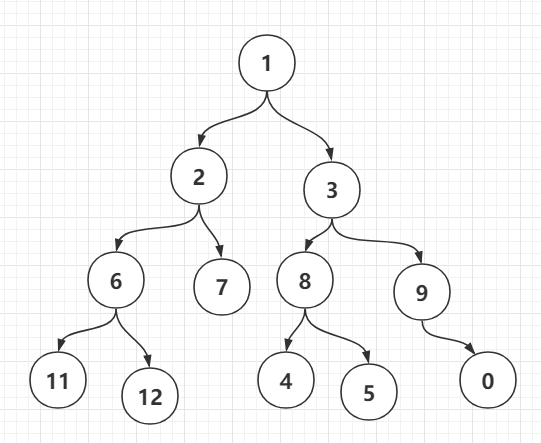

# 前序+中序遍历重建二叉树

假设有如图所示二叉树：

易得前序遍历为:

> [11,6,12,2,7,1,4,8,5,3,9,0]

中序遍历为 

> [1,2,6,11,12,7,3,8,4,5,9,0]

由中序遍历特性，可得`[1]`节点为根节点，再由前序遍历特性，可得`[11,6,12,2,7]`这部分序列为`[1]`节点的左子树，其对应中序的序列为`[2,6,11,12,7]`

此时得到了新的前序遍历序列：

> [11,6,12,2,7]

和新的中序遍历序列：

> [2,6,11,12,7]

不断地对分割后的新序列递归这个过程，即可求得最终的二叉树